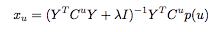

## Summary

For this question, I chose to build a recommendation engine that utilizes collaborative filter with the implicit ALS method, incorporating SparkMLlib's ability for in-memory distributed computing.

## Prepare Data

### Clean and Transform
Start with simple data profiling and look at the completeness of the data. Some basic stats of our current listening dataset is listed below:

Artist_seed - unique values: 505, None values: 0
Profile_id - unique values: 15305, None values: 0
Tracks_id – unique values: 500, None values: 0

You can see there is no empty values in our current dataset. However, if we start with a different dataset and values missing. We could make a decision on how to fill in empty values, whether to remove them or fill in a default value. In addition, we need to make sure the same artist does not occupy multiple rows in the artist table because of naming differences such as ‘Prince’, ‘The Prince’. In addition, since the artist_seeds and profile_ids  are very large numbers we can assign them an id that starts from 1 and update the artist, user, listen_count dataset to reference the smaller integer.

We want to be able to utilize user and artist data so we are going to aggregate data to user, artist, listen_count level, with listen_count representing how many times a user has listened to the same artist.

### Shuffle and Split

Split data into training and test set. Train model on the training set and evaluate model on the test set. To construct the training and test data, we want to avoid the situation where certain user's listening activities are only in the test set. We could select 1 activity per user to be in the test set.  We can then calculate the number of times the artist tracks was played by the user and captured by our recommendations. 



## Model
Here I decide on using the collaborative filter method to recommend artist based on the listening habit of similar users. Create a matrix of user/artist_seed/listen_counts. Matrix factorization could help us reduce the user-artist matrix(m*n) to two factors, user and artist. We could utilize ALS(alternating least square) method to minimize the RMSE value, which takes into how many times a user listened to an artist as the level of confidence. The cost function is listed below:


**


** J. Bennet and S. Lanning, “The Netflix Prize”, KDD
Cup and Workshop, 2007. www.netflixprize.
com.



## Model Evaluation

We could use RMSE value to evaluate the results. In addition we could use Recall to evaluate how many of the hidden activities(those we left in the test set) were captured by our recommendations and average it in our test set.

## Access the Results

Since the result would be large. We could batch processing the result nightly and store it in distributed clusters such as Cassandra and have them available for access from front end pages or apps. 


## Pros

When we are doing the ALS method for items, SparkMLlib split user listening history into different partitions by users and broadcast the YtY results to each partitions and only the artists a user has listened to, which is easy to work with on distributed systems. However the con of that is that one partition of users might cover all the artists and fitting all artists into the memory of one node might be a problem. 



## Cons

This method relies heavily on past listening history, which means if we do not have any history data to start with we will not arrive at any conclusion. In addition, we are likely to recommend popular artists than unknown/new artists. 



## Additional Information


We could combine this with some other techniques if the data is available. For instance, audio signals can be analyzed on convolutional neural networks. In additional, we could also combine text analysis, on news articles or social networks to analyze artists that are mentioned together. 

If we have data regarding how long a user listened to an artist we could remove some of the false postives as listening to an artist for one second and tune away does not really mean that the user likes the artist.




