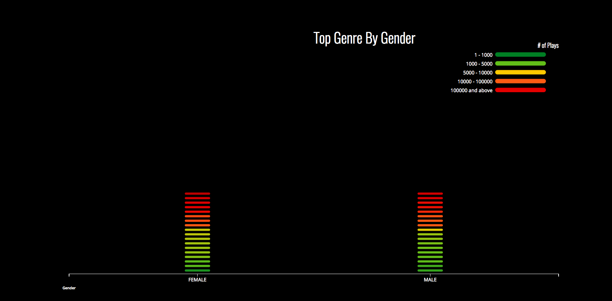
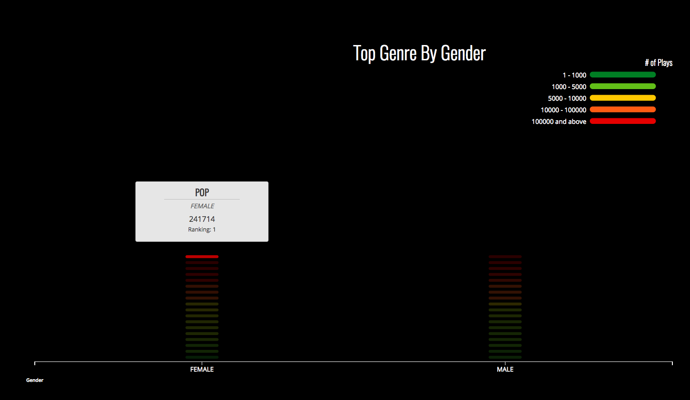
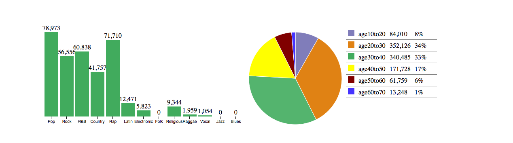

## Data Challenge ReadMe

### Question 1 and 2

For python related code and results: click [here](https://github.com/ying4uang/1-3challenge/blob/master/Data%20Challenge.ipynb)

### Question 3: Visualization

github code: click [here](https://github.com/ying4uang/vizmusic)

visualization1: [click](http://www.coupio.us:8080) to see live version

This is a bar graph with equalizer effect that shows the top 18 ranks by gender colored by total number of times played.

 

[visualization2](http://www.coupio.us:8080/viz2.html)
 

### Question 4: Modelling

click [here](https://github.com/ying4uang/1-3challenge/blob/master/Model%20Project.md)

